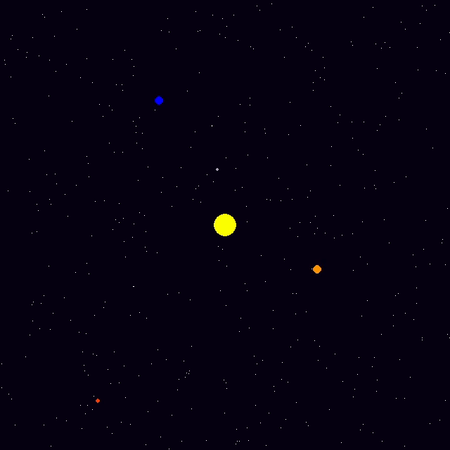

# Celestial Orbits
Just a small project made in a couple of hours.
It's a simulation of the solar system up to mars.

The sizes of the bodies are not accurate, since
there's not a proper zoom function in pygame.
However, their relative speeds should be accurate.

## Usage
To run the project, run these 4 commands
consecutively.

```
git clone https://github.com/Parslie/celestial-orbits.git
cd celestial-orbits
pip install -r requirements.txt
python src/main.py
```

> 